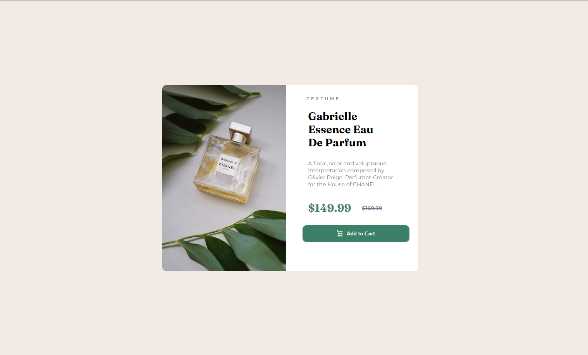
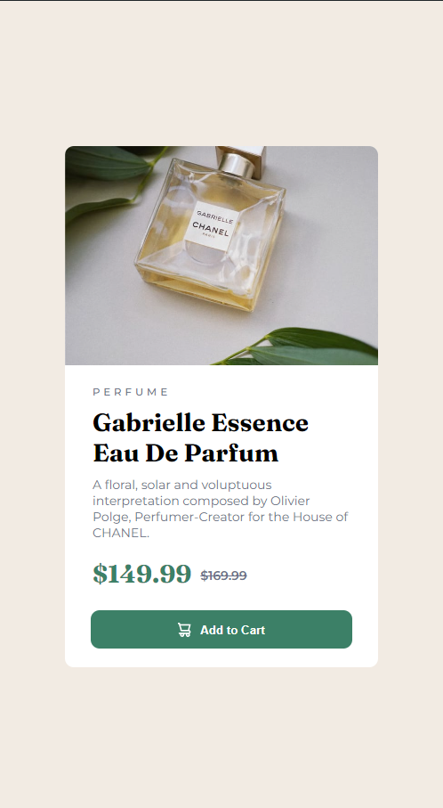

# Frontend Mentor - Product preview card component solution

This is a solution to the [Product preview card component challenge on Frontend Mentor](https://www.frontendmentor.io/challenges/product-preview-card-component-GO7UmttRfa). Frontend Mentor challenges help you improve your coding skills by building realistic projects.

## Table of contents

- [Overview](#overview)
  - [The challenge](#the-challenge)
  - [Screenshot](#screenshot)
  - [Links](#links)
- [My process](#my-process)
  - [Built with](#built-with)
  - [What I learned](#what-i-learned)
  - [Continued development](#continued-development)
  - [Useful resources](#useful-resources)
- [Author](#author)

## Overview

### The challenge

Users should be able to:

- View the optimal layout depending on their device's screen size
- See hover and focus states for interactive elements

### Screenshot

Desktop (passive):

Desktop (active):

mobile:

Links

- Solution URL: [ here](https://github.com/Yahia-kilany/product-preview-card-component-main)
- Live Site URL: [here](https://yahia-kilany.github.io/product-preview-card-component-main/)

## My process

### Built with

- Semantic HTML5 markup
- Media Rules
- Flexbox
- CSS Grid
- Mobile-first workflow
- CSS custom properties

### What I learned

First time to try to make a responsive page, using a mobile first approach and using media rules.

### Continued development

I should try to learn more on.

### Useful resources

- MDN documentation
- W3Schools

## Author

- Frontend Mentor - [@yourusername](https://www.frontendmentor.io/profile/yourusername)
